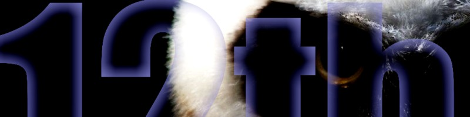

<!-- THE MAIN WIDE HEADER BANNER -->
  

    
  

# Give-A-Hoot 🦉

An aficionado of technological security, defense, mechanics, music, electronics, movies, space, multi-dimensional beings, and intellects of all kinds. There is usually something battling on, simmering down, or what-have-you to experience. Perhaps some of mine will be of comfort or help.

---

<!-- THE SUB-BANNER WITH THE OWL EYE AND '12th' -->
<!--  <!-->

> *This site seems geared toward coding or CI/CD typical scenarios for which my universe is devoid... for now.* 

This is the beginning of my GitHub journey in real-time. I will fill in the history blanks in given time.

### 🛠️ The Workbench
Check out my primary repository: **[Give-A-Hoot](https://github.com/twelfthOwlet/Give-A-Hoot)**
*(Home to the Nocturnal-Melt journals, the 12th-Break-Mend hardware logs, and the Trial-by-Fire engineering chronicles.)*

---

<!-- THE INTERNAL-NEST CIRCUITRY GRAPHIC -->
 

    
  

